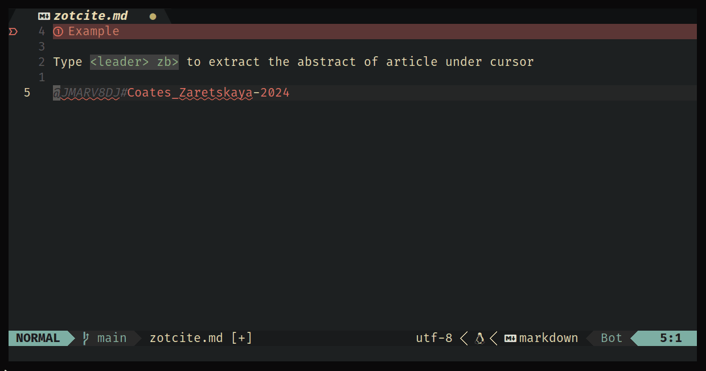
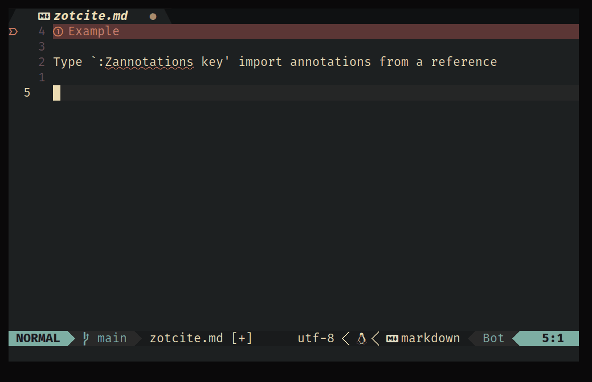

# Zotcite

> [!Note]
> Users of Vim and Neovim < 0.10 have to install the branch "vim".

_Zotcite_ is a Neovim plugin that provides integration with Zotero. With
_zotcite_ you can:

- Do auto-completion of citation keys from Zotero database in
  Markdown, RMarkdown and Quarto documents (with `cmp-zotcite`).

  

  

- Quickly see on the status bar information on the reference under the cursor.

  

  

- Extract the corresponding abstract from the article.

  

- Importing annotations can be done using `:Zannotations <key>`

  

- Importing specific annotations from an article `:Zselectannotations <key>`

  

  - Use the `zotref.py` filter to pre-process the Markdown document before the
    citations are processed by `pandoc`, avoiding the need of `bib` files.

  - Open the PDF attachment of the reference associated with the citation key
    under the cursor.

  - Extract highlighted text and text notes from PDF attachments of
    references.

  - Extract Zotero notes and annotations from Zotero database.

  - Add all cited references to the YAML header of the Markdown document.

_Zotcite_ is being developed and tested on Linux and should work flawlessly on
other Unix systems, such as Mac OS X. It may require additional configuration
on Windows.

## Installation

Requirements:

- Zotero >= 5

- Python 3

- Python 3 modules pynvim (see Neovim documentation on `provider-python` for
  details) and PyYAML.

- Python modules PyQt5 and python-poppler-qt5 (only if you are going to extract
  annotations from PDF documents). On Debian based Linux distributions, you
  can install them with the command:

  `sudo apt install python3-pyqt5 python3-poppler-qt5`

Depending on your system, you may have to install python modules in an virtual
environment and maybe also system-wide.

Zotcite can be installed as any Neovim plugin, and it depends on
[cmp-zotcite](https://github.com/jalvesaq/cmp-zotcite) and
[nvim-treesitter](https://github.com/nvim-treesitter/nvim-treesitter) as well
as tree-sitter parser for `markdown`, `markdown_inline`, and `yaml`. Below is
an example of how to install it with [lazy.nvim](https://github.com/folke/lazy.nvim):

```lua
    {
        'jalvesaq/zotcite',
        dependencies = {
            "nvim-treesitter/nvim-treesitter",
        }
        config = function ()
            require("zotcite").setup({
                -- your options here (see doc/zotcite.txt)
            })
        end
    },

    {
        "nvim-treesitter/nvim-treesitter",
        run = ":TSUpdate",
        config = function ()
            require("nvim-treesitter.configs").setup({
                sync_install = true,
                ensure_installed = {
                    "html",
                    "latex",
                    "markdown",
                    "markdown_inline",
                    "yaml",
                },
                highlight = {
                    enable = true,
                },
                indent = {
                    enable = true,
                },
            })
            vim.o.foldmethod = "expr"
            vim.o.foldexpr = "nvim_treesitter#foldexpr()"
            vim.o.foldenable = false
        end
    },
```

Note: you don't need to lazy load zotcite because it already lazy loads its
modules only for the supported file types.

The Python module `zotero` does not import the `vim` module. Hence, its code
could easily be adapted to other text editors or as a language server for
markdown and quarto.

## Usage

Please, read the plugin's
[documentation](https://raw.githubusercontent.com/jalvesaq/zotcite/master/doc/zotcite.txt)
for further instructions.

## Acknowledgment

Zotcite's Python code was based on the
[citation.vim](https://github.com/rafaqz/citation.vim) project.
